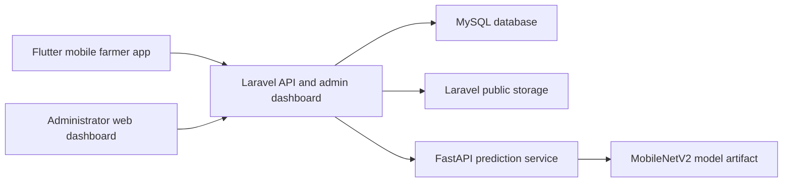
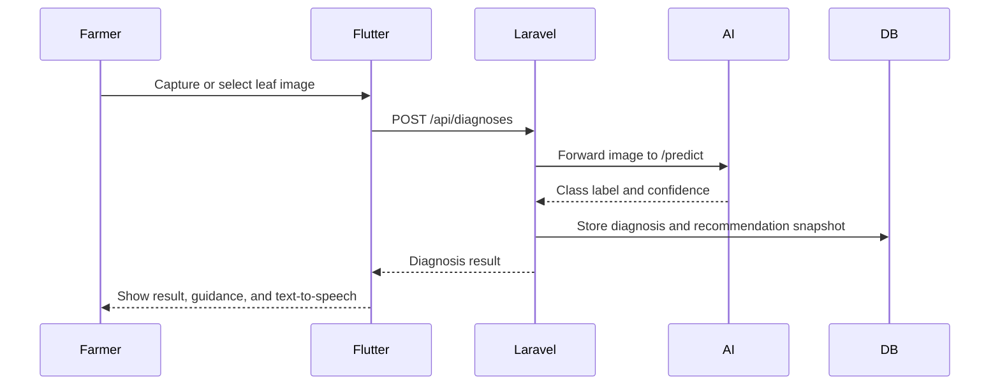

# Implementation Notes

## Chapter Four Diagrams

### System Architecture

### Diagnosis Workflow

## Performance Targets

The codebase contains the API paths and tests needed to measure these targets in a deployed environment:

| Capability | Target |
| --- | --- |
| Login response | Under 2 seconds |
| Image upload | Under 3 seconds under normal network conditions |
| Disease prediction | Under 5 seconds with the Python service running locally or on the same network |
| Diagnosis history retrieval | Under 2 seconds |

Local PHPUnit coverage confirms the backend request paths are operational. Final timing should be measured after MySQL, Laravel, Flutter, and the Python service are deployed on the intended machines.

## AI Dataset Status

The repository now contains the complete AI workflow scaffolding:

- `AI Service/scripts/prepare_dataset.py`
- `AI Service/scripts/train_mobilenetv2.py`
- `AI Service/scripts/evaluate_model.py`
- `AI Service/labels.json`

Real accuracy, precision, recall, F1-score, and confusion matrix values require actual labeled crop images in `AI Service/data/raw/<class_label>/`. The scripts are ready for that dataset and export `models/mobilenetv2_crop_disease.keras` for inference.

## Privacy And Deployment

- Use HTTPS for Laravel, the mobile API base URL, and the Python prediction service in production.
- Raw `image_path` values are hidden from API JSON.
- Farmers can only read their own diagnosis history.
- Admin pages require a valid admin API token.
- Uploaded crop images and diagnosis history should be treated as private farmer data.
